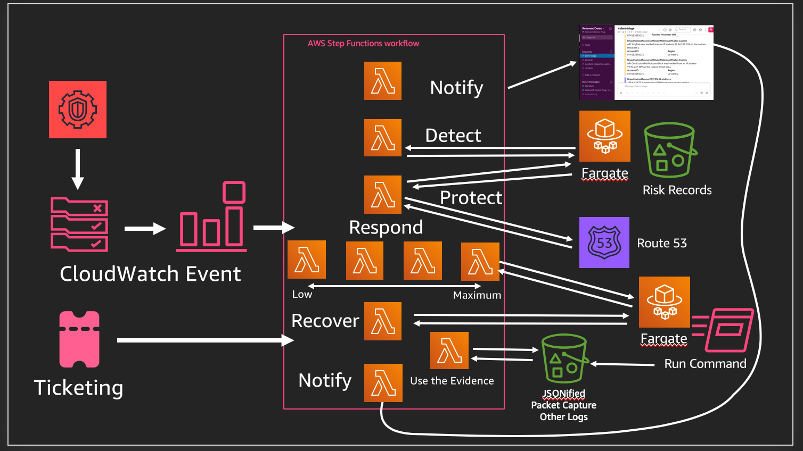

# Fargate IR
Proof of concept around how the SSM Agent running in Fargate can be orchestrated to help with incident response.

## Build status

## Status

Work in progress. Proof of concept only.  **Non Production Use**

## Basic Flow

## To Do

* Generate presigned urls to evidence loaded to s3.
* Reduce scope of IAM roles further for steps in the step-function.
* Improve integration test coverage.
* Improve unit test coverage.

## References

[jicowan original work on SSM Agent in Fargate](https://github.com/jicowan/ssm-agent)

[Youtube Link to SEC318 - Coming Soon]()

[Slides from SEC318 - Coming Soon]()